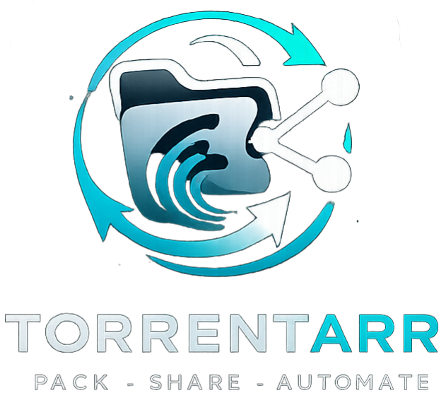

# Torrentarr

Pack • Share • Automate

<p align="center">
  
</p>

<p align="center">
  
  
  
  
  
</p>

------------------------------------------------------------------------

Torrentarr is a **Dockerized Bash tool** that generates tracker‑ready
`.torrent` and `.nfo` files directly from media libraries managed by
**Radarr** and **Sonarr**.

It automates the creation of properly named torrent releases using the
real metadata of your media files.

------------------------------------------------------------------------

# Features

## Movies

-   Match movie folders against Radarr
-   Read media metadata automatically
-   Generate tracker‑style release names
-   Create `.torrent`
-   Create `.nfo`

## Series

-   Match series folders against Sonarr
-   Generate:
    -   season packs
    -   episode torrents
    -   full series packs for ended shows
-   Use majority metadata for packs
-   Create `.torrent`
-   Create `.nfo`

------------------------------------------------------------------------

# Requirements

-   Docker
-   Radarr
-   Sonarr
-   Media files already organized by the \*arr ecosystem

------------------------------------------------------------------------

# Installation

Clone the repository:

``` bash
git clone https://github.com/Silastar/Torrentarr.git
cd Torrentarr
```

Start the container:

``` bash
docker compose up -d --build
```

Enter the container:

``` bash
docker exec -it torrentarr bash
```

Run Torrentarr:

``` bash
./torrent_creator.sh
```

------------------------------------------------------------------------

# Docker Paths Configuration

Before starting the container you **must adapt the volume paths** in
`docker-compose.yml` so they match your media directories.

## Example docker-compose

``` yaml
services:
  torrentarr:
    build: .
    container_name: torrentarr

    volumes:
      - /mnt/user/MEDIA:/MEDIA
      - /mnt/user/TORRENTS:/TORRENTS
      - ./config.env:/config.env
```

### Path Explanation

| Container Path | Purpose |
|---------------|--------|
| `/MEDIA` | Root folder containing your Radarr and Sonarr media libraries |
| `/TORRENTS` | Output directory where `.torrent` and `.nfo` files are written |

### Important

The paths on the **left side** must match your actual server filesystem.

### Example Unraid

    /mnt/user/MEDIA
    /mnt/user/TORRENTS

### Example Linux

    /data/media
    /data/torrents

After adjusting the paths start Torrentarr:

``` bash
docker compose up -d --build
```

------------------------------------------------------------------------

# Project Structure

    Torrentarr/
    │
    ├── lib/
    │   ├── common.sh
    │   ├── movies.sh
    │   └── series.sh
    │
    ├── assets/
    │   └── logo.png
    │
    ├── torrent_creator.sh
    ├── Dockerfile
    ├── docker-compose.yml
    └── config.env.example

------------------------------------------------------------------------

# Roadmap

Planned improvements:

-   UI interface
-   Automatic batch processing
-   Tracker profile support
-   Improved metadata detection
-   Unraid template

------------------------------------------------------------------------

# Contributing

Contributions are welcome.

1.  Fork the repository
2.  Create a feature branch
3.  Commit your changes
4.  Open a Pull Request

Bug reports and feature requests can be submitted via GitHub Issues.

------------------------------------------------------------------------

# License

This project is currently provided **without a formal license**. A
license will be added in a future release.
